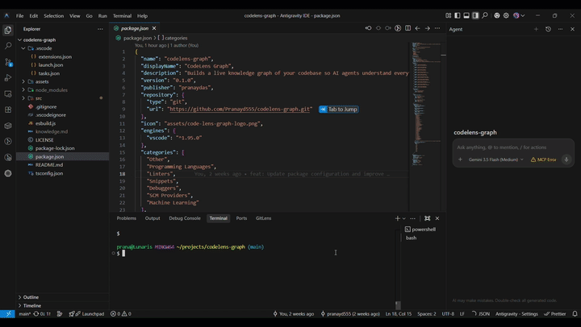

# CodeLens Graph

> A VS Code extension that builds a live knowledge graph of your codebase and exposes it as an MCP server — so AI agents find the right symbols instantly, use the minimum tokens needed, and never hallucinate about what already exists.



**GitHub:** [github.com/pranayd555/codelens-graph](https://github.com/pranayd555/codelens-graph)

---

## How it works

On activation, CodeLens Graph silently indexes your entire codebase into a local SQLite graph — every file, class, function, method, variable, import, and call relationship. It then starts an MCP server exposing 9 tools the agent calls natively, just like `read_file`.

The key insight: instead of the agent reading 5–10 files to orient itself, it calls one MCP tool and gets back only the relevant symbols, snippets, and relationships for the current task.

---

## Token efficiency — the 4-tier model

Not every task needs the same depth of context. The `codelens_triage` tool classifies the task first so the agent uses the cheapest approach:

| Tier | Task type | Tool | Token cost |
|------|-----------|------|------------|
| 1 | Typo, comment, format | None | 0 tokens |
| 2 | "Where is X defined?" | `codelens_search` | ~50 tokens |
| 3 | Feature / bug fix | `codelens_context` | ~200–500 tokens |
| 4 | Refactor / rename across files | `codelens_context` + `codelens_impact` | ~600–1200 tokens |

The agent always calls `codelens_triage` first. It costs ~10 tokens and prevents a Tier 1 task from triggering a full Tier 3 context pull.

---

## MCP Tools (9 total)

| Tool | Purpose | When to use |
|------|---------|-------------|
| `codelens_triage` | Classify task → pick minimum tool | **Always first** |
| `codelens_search` | Find symbol by name → exact file:line | Tier 2 |
| `codelens_context` | Compressed context for a task | Tier 3 |
| `codelens_callers` | What calls a function | Tier 4 / before refactor |
| `codelens_callees` | What a function calls | Tier 4 / dependencies |
| `codelens_impact` | Full impact radius of a change | Tier 4 |
| `codelens_node` | Full details + snippet for one symbol | Any tier |
| `codelens_files` | File structure by category | Project orientation |
| `codelens_status` | Graph health + statistics | Debugging |

---

## Installation

### Install the VS Code extension

```bash
code --install-extension codelens-graph-0.1.0.vsix
```

Or: `Ctrl+Shift+P` → `Extensions: Install from VSIX…`

### Connect your AI agent (one-time per project)

CodeLens Graph features an automatic configuration engine that sets up MCP settings and inserts mandatory search rules for your favorite AI assistants:

1. **Automatic Setup (Recommended):**
   Upon initial scan or by running the `CodeLens: Regenerate AI Agent Skill Files` command, the extension will prompt you to select your target IDEs/assistants:
   - **VS Code (Copilot / Trae)**: Writes MCP server configuration to `.vscode/mcp.json` and instruction rules to `.vscode/codelens.instructions.md`.
   - **Cursor**: Writes instruction rules to `.cursor/rules/codelens.mdc`.
   - **Antigravity**: Integrates instruction rules into `.agents/AGENTS.md`.
   - **Claude Code**: Integrates instruction rules into `CLAUDE.md`.
   - **Windsurf (Cascade)**: Integrates instruction rules into `.windsurfrules`.

2. **Manual Configuration:**
   If you want to configure your global/user MCP settings manually:
   - Click **"Copy MCP Config"** in the notification, or run the `CodeLens: Copy MCP Config to Clipboard` command.
   - Paste the config into your global config file:
     - **Claude Code (global)**: paste into `~/.claude.json`.
     - **Cursor (local)**: paste into `.cursor/mcp.json`.

> **Important:** The graph database lives in `.codelens/` inside your project. Both the extension and the MCP server use the same database — no external directory lookups, no permission popups.

---

## Commands

| Command | Purpose |
|---------|---------|
| `CodeLens: Build Knowledge Graph` | Full scan of workspace |
| `CodeLens: Force Rebuild Graph` | Clear and rescan |
| `CodeLens: Show Graph Explorer` | Interactive D3 force graph |
| `CodeLens: Show Agent Context Preview` | Preview context for a task |
| `CodeLens: Search Symbol in Graph` | Find any symbol instantly |
| `CodeLens: Copy MCP Config to Clipboard` | Get ready-to-paste agent config |
| `CodeLens: Get Context for Task (Agent)` | Fetch task context (CLI command for agents) |
| `CodeLens: Update Graph After Agent Run` | Re-index after agent changes |
| `CodeLens: Regenerate AI Agent Skill Files` | Regenerate rules/MCP configs and prompt for IDE preferences |
| `CodeLens: Show MCP Usage Report` | Show total agent tool calls and token savings |

---

## Settings

| Setting | Default | Description |
|---------|---------|-------------|
| `codeLensGraph.autoRebuildOnSave` | `true` | Update graph on file save |
| `codeLensGraph.maxGraphDepth` | `2` | BFS hops from entry points |
| `codeLensGraph.maxTokenBudget` | `2000` | Token cap for agent context |
| `codeLensGraph.excludePatterns` | `node_modules, dist…` | Folders to skip |
| `codeLensGraph.supportedExtensions` | `.ts .js .py .go .rs…` | Languages to parse |

---

## Architecture

```
src/
├── extension.ts              # VS Code entry point, command registration
├── types.ts                  # GraphNode, GraphEdge, AgentContext, Diagnosis
├── ingestion/
│   ├── astParser.ts          # tree-sitter WASM parser (regex fallback)
│   ├── workspaceScanner.ts   # Walks workspace, async file parsing
│   └── fileWatcher.ts        # Incremental graph updates on save
├── graph/
│   ├── graphDB.ts            # SQLite: nodes, edges, snapshots, migrations
│   └── differ.ts             # Pre/post agent run diff engine
├── context/
│   ├── contextBuilder.ts     # Task → BFS subgraph → compressed context
│   ├── snippetExtractor.ts   # Reads exact code lines for symbols
│   └── fileClassifier.ts     # Groups files by semantic category
├── agent/
│   ├── skillGenerator.ts     # Writes .codelens/mcp.json + README
│   └── backgroundScanner.ts  # Silent background scan on activation
├── mcp/
│   ├── mcpServer.ts          # 9 MCP tools (triage, search, context…)
│   └── mcpEntry.ts           # Standalone MCP binary entry point
└── ui/
    ├── graphPanel.ts         # D3 force-directed graph webview
    └── statsView.ts          # Sidebar stats panel (WebviewViewProvider)
```

---

## Database location

The graph database is stored at `.codelens/codelens-graph.db` inside your project workspace. This ensures:
- The VS Code extension and MCP server share the same database
- No external directory permission prompts for the agent
- The DB is gitignored automatically

---

## Development

```bash
git clone https://github.com/pranayd555/codelens-graph.git
cd codelens-graph
npm install

# Type check
npx tsc --noEmit

# Compile
npm run compile

# Test with F5 in VS Code (launches Extension Development Host)

# Package
npx vsce package --allow-missing-repository
```

---

## Roadmap

- [ ] tree-sitter WASM grammar auto-download on first run
- [ ] `codelens_affected` — given changed files, return impacted test files (CI use)
- [ ] Snapshot diff viewer — graph before/after agent run comparison panel
- [ ] Vector embeddings for semantic symbol search (`@xenova/transformers`)
- [ ] Team sync — shared graph via optional cloud backend

---

## License

MIT © [pranayd555](https://github.com/pranayd555)
