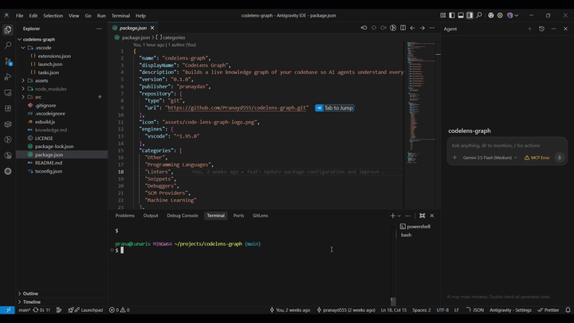

# CodeLens Graph

> A VS Code extension that builds a live codebase knowledge graph for AI agents (Cursor, Claude Code, Antigravity, Windsurf, Copilot) to reduce token consumption, prevent hallucinations, and build precise context via Model Context Protocol (MCP).



**GitHub:** [github.com/pranayd555/codelens-graph](https://github.com/pranayd555/codelens-graph)

---

## Why CodeLens Graph? Return on Investment (ROI)

When an AI agent runs in a medium-to-large project, it often resorts to scanning the entire directory or dumping multiple full files to understand context. This is incredibly slow and wastes massive amounts of tokens.

CodeLens Graph fixes this by providing exact, targeted symbol subgraphs:

| Search Method | Token Consumption | Execution Speed | Cost per Task |
| :--- | :--- | :--- | :--- |
| Brute-Force Folder Dump | 50k+ tokens | 15 - 30 seconds | High ($$$) |
| **CodeLens Graph Context** | **< 2k tokens** | **< 1 second** | **Negligible ($)** |

---

## How it works

CodeLens Graph is opt-in per workspace. The first time you open a folder, it asks **"Use CodeLens Graph in this workspace?"** once VS Code has settled. Until you answer **Yes**, nothing is parsed and no files are created. **No** keeps it off for that workspace only — other folders and other open VS Code windows keep their own choice. Your answer is stored privately in VS Code (not in the project), and you can change it anytime from the CodeLens sidebar or with **CodeLens: Turn On / Turn Off for This Workspace**. Workspaces that already have a `.codelens/` index are treated as **Yes**.

Once it is on (and the workspace is trusted), CodeLens Graph indexes your entire codebase in the background into a local SQLite graph — every file, class, function, method, variable, import, call relationship, project configurations (like `package.json`, `tsconfig.json`, `.yml`, etc.), and the direct dependencies declared in your `package.json` files (installed version, entry points, type definitions — read without walking or parsing `node_modules`). You choose which folders are indexed from the **Indexed Folders** view; very large workspaces are not indexed until you pick. It then starts an MCP server exposing 10 tools the agent calls natively, just like `read_file`.

The key insight: instead of the agent reading 5–10 files to orient itself, it calls one MCP tool and gets back only the relevant symbols, snippets, and relationships for the current task.

---

## Token efficiency — the 4-tier model

Not every task needs the same depth of context. The `codelens_triage` tool classifies the task first so the agent uses the cheapest approach:

| Tier | Task type | Tool | Token cost |
|------|-----------|------|------------|
| 1 | Typo, comment, format | None | 0 tokens |
| 2 | "Where is X defined?" | `codelens_search` | ~50 tokens |
| 3 | Feature / bug fix | `codelens_context` (short/deep) | ~200–500 tokens |
| 4 | Refactor / rename across files | `codelens_context` + `codelens_impact` | ~600–1200 tokens |

The agent always calls `codelens_triage` first. It costs ~10 tokens and prevents a Tier 1 task from triggering a full Tier 3 context pull.

---

## MCP Tools (11 total)

| Tool | Purpose | When to use |
|------|---------|-------------|
| `codelens_triage` | Classify task → pick minimum tool | **Always first** |
| `codelens_search` | Find symbol by name → exact file:line | Tier 2 |
| `codelens_context` | Compressed context for a task (`short` / `deep`) | Tier 3 |
| `codelens_dependencies` | Query packages & configurations | Dependency analysis / configurations lookup |
| `codelens_relations` | Find callers (incoming) or callees (outgoing) of a symbol | Tier 4 / refactor |
| `codelens_text_search` | Fuzzy search for comments, strings, or arbitrary text | Tier 2 / keyword lookup |
| `codelens_impact` | Full impact radius of a change | Tier 4 |
| `codelens_node` | Full details + snippet for one symbol | Any tier |
| `codelens_files` | File structure by category | Project orientation |
| `codelens_status` | Graph health + statistics | Debugging |
| `codelens_clear_config` | Clear all CodeLens configuration & rule files | State reset / uninstall |

---

## Installation

### Install the VS Code extension

```bash
code --install-extension codelens-graph-0.3.1.vsix
```

Or: `Ctrl+Shift+P` → `Extensions: Install from VSIX…`

### Connect your AI agent (one-time per project)

CodeLens Graph features an automatic configuration engine that sets up MCP settings and inserts mandatory search rules for your favorite AI assistants:

1. **Automatic Setup (Recommended):**
   When the first index finishes, CodeLens offers a one-time setup (**Choose Agents… / Not Now / Don't Ask Again**). Nothing outside `.codelens/` is written until you choose. You can also run the `CodeLens: Regenerate AI Agent Skill Files` command at any time to select your target IDEs/assistants:
   - **VS Code (Copilot / Trae)**: Writes MCP server configuration to `.vscode/mcp.json` and instruction rules to `.vscode/codelens.instructions.md`.
   - **Cursor**: Writes instruction rules to `.cursor/rules/codelens.mdc`.
   - **Antigravity**: Integrates instruction rules into `.agents/AGENTS.md`.
   - **Claude Code**: Integrates instruction rules into `CLAUDE.md`.
   - **Windsurf (Cascade)**: Integrates instruction rules into `.windsurfrules`.

2. **Manual Configuration:**
   If you want to configure your global/user MCP settings manually:
   - Click **"Copy MCP Config"** in the notification, or run the `CodeLens: Copy MCP Config to Clipboard` command.
   - Paste the config into your global config file:
     - **Claude Code (global)**: paste into `~/.claude.json`.
     - **Cursor (local)**: paste into `.cursor/mcp.json`.

> **Important:** The graph database lives in `.codelens/` inside your project. Both the extension and the MCP server use the same database — no external directory lookups, no permission popups.

---

## Commands

| Command | Purpose |
|---------|---------|
| `CodeLens: Turn On for This Workspace` | Start using CodeLens in this workspace (only this one) |
| `CodeLens: Turn Off for This Workspace` | Stop indexing and watching this workspace; existing files are kept. The standalone MCP server also answers "off" here |
| `CodeLens: Build Knowledge Graph` | Full scan of workspace |
| `CodeLens: Force Rebuild Graph` | Clear and rescan |
| `CodeLens: Show Graph Explorer` | Interactive D3 force graph |
| `CodeLens: Show Agent Context Preview` | Preview context for a task |
| `CodeLens: Search Symbol in Graph` | Find any symbol instantly |
| `CodeLens: Copy MCP Config to Clipboard` | Get ready-to-paste agent config |
| `CodeLens: Get Context for Task (Agent)` | Fetch task context (CLI command for agents) |
| `CodeLens: Update Graph After Agent Run` | Re-index after agent changes |
| `CodeLens: Regenerate AI Agent Skill Files` | Regenerate rules/MCP configs and prompt for IDE preferences |
| `CodeLens: Show MCP Usage Report` | Show total agent tool calls and token savings |
| `CodeLens: Clear Configuration Files and Reset State` | Clean up all CodeLens-generated rule files/configs and reset extension state |
| `CodeLens: Select Indexed Folders…` | Pick which folders are indexed (with file counts); also available as checkboxes in the **Indexed Folders** view |
| `CodeLens: Index Entire Workspace` | Clear the folder selection and index everything |

---

## Settings

| Setting | Default | Description |
|---------|---------|-------------|
| `codeLensGraph.autoRebuildOnSave` | `true` | Update graph on file save |
| `codeLensGraph.maxGraphDepth` | `2` | BFS hops from entry points |
| `codeLensGraph.maxTokenBudget` | `2000` | Token cap for agent context |
| `codeLensGraph.includeFolders` | `[]` (whole workspace) | Folders to index, workspace-relative. Root-level files are always indexed. Stored in `.vscode/settings.json`, so the team and a standalone MCP server share it |
| `codeLensGraph.largeWorkspaceThreshold` | `5000` | Above this many indexable files, a never-indexed workspace waits for a folder selection |
| `codeLensGraph.excludePatterns` | `node_modules, dist…` | Globs to skip (`**` supported) |
| `codeLensGraph.supportedExtensions` | `.ts .js .py .go .rs…` | Languages to parse |

---

## Architecture

```
src/
├── extension.ts              # VS Code entry point, command registration
├── types.ts                  # GraphNode, GraphEdge, AgentContext, Diagnosis
├── utils.ts                  # Path helpers, configuration whitelist, glob matching
├── ingestion/
│   ├── astParser.ts          # tree-sitter WASM parser (regex fallback)
│   ├── workspaceScanner.ts   # Walks the selected folders, reconciles the graph with them
│   ├── indexScope.ts         # Folder selection (codeLensGraph.includeFolders) rules
│   ├── dependencyManifest.ts # Direct dependencies from package.json (no node_modules walk)
│   └── fileWatcher.ts        # Standalone file watcher (outside VS Code)
├── graph/
│   ├── graphDB.ts            # SQLite graph store (integer-keyed), relationship resolution
│   └── differ.ts             # Pre/post agent run diff engine
├── context/
│   ├── contextBuilder.ts     # Task → BFS subgraph → compressed context
│   ├── snippetExtractor.ts   # Reads exact code lines for symbols
│   └── fileClassifier.ts     # Groups files by semantic category
├── agent/
│   ├── skillGenerator.ts     # Writes .codelens/mcp.json + README
│   └── backgroundScanner.ts  # Queued background scans and batched file-change updates
├── mcp/
│   ├── mcpServer.ts          # 10 MCP tools (triage, search, context, dependencies…)
│   └── mcpEntry.ts           # Standalone MCP binary entry point
└── ui/
    ├── graphPanel.ts         # D3 force-directed graph webview
    ├── statsView.ts          # Sidebar stats panel (WebviewViewProvider)
    └── indexedFoldersView.ts # Sidebar folder tree with checkboxes
```

---

## Database location

The graph database is stored at `.codelens/codelens-graph.db` inside your project workspace. This ensures:
- The VS Code extension and MCP server share the same database
- No external directory permission prompts for the agent
- The DB is gitignored automatically (via `.codelens/.gitignore` — your root `.gitignore` is not modified)
- Storage is compact: integer keys and workspace-relative paths (roughly 12 KB per indexed source file). Indexes written by older versions are rebuilt automatically once

---

## Development

```bash
git clone https://github.com/pranayd555/codelens-graph.git
cd codelens-graph
npm install

# Type check
npx tsc --noEmit

# Compile
npm run compile

# Test with F5 in VS Code (launches Extension Development Host)

# Package
npx vsce package --allow-missing-repository
```

---

## Roadmap

- [ ] tree-sitter WASM grammar auto-download on first run
- [ ] `codelens_affected` — given changed files, return impacted test files (CI use)
- [ ] Snapshot diff viewer — graph before/after agent run comparison panel
- [ ] Vector embeddings for semantic symbol search (`@xenova/transformers`)
- [ ] Team sync — shared graph via optional cloud backend

---

## License

MIT © [pranayd555](https://github.com/pranayd555)
